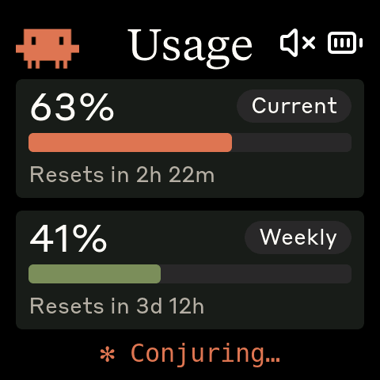
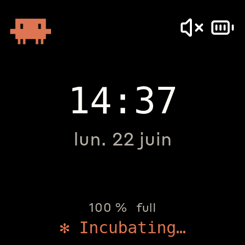
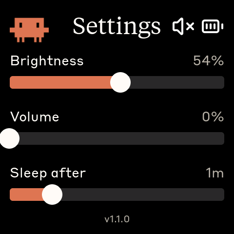
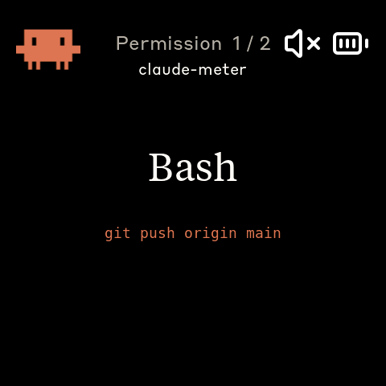

# claude-meter

> **This is a fork of [HermannBjorgvin/Clawdmeter](https://github.com/HermannBjorgvin/Clawdmeter).**
> It tracks all of the original's functionality and adds a clock screen, a settings
> screen, a live Claude Code state line, an approval screen that mirrors tool-permission
> prompts, audio chimes + volume control, light-sleep power saving, over-the-air firmware
> updates, and a rewritten cross-platform host daemon. The BLE device still advertises as
> `Clawdmeter`, so the pairing and daemon flow are unchanged. Full credit for the original
> project and the bulk of the firmware goes upstream.

A small ESP32 dashboard for your desk that keeps an eye on your Claude Code usage **and**
the live state of your sessions. It pairs over Bluetooth Low Energy to a host daemon that
polls the Anthropic API for usage and feeds Claude Code's session state to the display.

|              Usage meter              |          Idle Clawd animation          |
| :-----------------------------------: | :------------------------------------: |
|  |  |

The Clawd animations come from [claudepix](https://claudepix.vercel.app), [@amaanbuilds](https://x.com/amaanbuilds)'s library of pixel-art Clawd sprites — check it out, it's lovely.

## Features

- **Usage meter** — your 5-hour ("Current") and 7-day ("Weekly") rate-limit utilization as
  two bars, each with a "resets in …" countdown and a limited/allowed status.
- **Live Claude Code state** — a status line that shows whether Claude is working (an animated
  whimsical verb + spinner), finished its turn, idle, or waiting on you. State changes wake the
  panel so you notice them across the room.
- **Approval screen** — when Claude Code raises a tool-permission prompt, the device mirrors it
  (tool name, the command/path/url, the project name, and an `i / N` badge when several are
  queued). It's display-only — you still approve on your laptop — and you can swipe between
  pending prompts.
- **Clock screen** — wall-clock + date + battery, reached by swiping. Boards with a hardware RTC
  (the C6) keep correct time offline; the others sync time from the daemon.
- **Settings screen** — tap the logo to open sliders for brightness, chime volume (audio boards),
  and the auto-sleep delay. The firmware version is shown at the bottom.
- **Audio chimes** — boards with a speaker (the C6) play a chime when Claude needs you and when it
  finishes; volume is adjustable from settings or the secondary button.
- **Light-sleep power saving** — the panel fades out after a configurable idle delay and the CPU
  drops to a low-power loop; touch, a button, Claude activity, or USB power wakes it. It never
  sleeps while on USB power.
- **OTA firmware updates** — push a new build to the device over the existing BLE link, no USB
  cable required (see [OTA updates](#ota-updates)).
- **Three boards, one firmware** — a thin per-board HAL means the same UI runs on all supported
  boards; adding a board is a folder + a PlatformIO env.

## Feature support by board

Everything is built from one codebase; a few features depend on hardware that only some boards
have (a speaker, a hardware RTC, a second button, PSRAM).

| Feature | 2.16″ S3 | 2.16″ C6 | 1.8″ S3 |
| --- | :---: | :---: | :---: |
| Usage meter (5h + weekly) | ✅ | ✅ | ✅ |
| Live Claude Code state + status line | ✅ | ✅ | ✅ |
| Approval screen (permission mirror) | ✅ | ✅ | ✅ |
| Clock screen (swipe) | ✅ | ✅ | ✅ |
| Offline clock (hardware RTC) | — | ✅ | — |
| Settings (brightness / sleep delay) | ✅ | ✅ | ✅ |
| Audio chimes | — | ✅ | — |
| Volume control | — | ✅ | — |
| Light-sleep power saving | ✅ | ✅ | ✅ |
| OTA firmware update (over BLE) | ✅ | ✅ | ✅ |
| Battery gauge | ✅ | ✅ | ✅ |
| IMU auto-rotation | ✅ | ✅ | — (fixed portrait) |
| Secondary button | ✅ | ✅ | — (single button) |
| Screenshot via `screenshot.sh` | ✅ (snapshot) | ✅ (streamed) | ✅ (snapshot) |
| PSRAM | ✅ | — | ✅ |

## Screens

The device boots into the **Usage** screen. **Swipe** left/right to cycle Usage → Clock →
any pending Approval and back. **Tap the logo** (top-left) to open Settings. The Approval
screen is raised automatically whenever Claude Code is waiting on a permission prompt, and
drops back when the prompt is resolved.

|              Usage              |              Clock              |
| :-----------------------------: | :-----------------------------: |
|  |  |
| 5h + weekly utilization, live status line | Wall-clock, date, battery (swipe to reach) |

|              Settings              |              Approval              |
| :--------------------------------: | :--------------------------------: |
|  |  |
| Brightness / volume / sleep sliders (tap the logo) | Mirrors a Claude Code permission prompt |

When the device has no fresh data it shows an idle sleeping-Clawd animation; while disconnected
it shows a pairing hint (**hold the power button for 3 seconds, then release, to enter pairing
mode** — this clears the saved Bluetooth bond and re-advertises).

## Hardware

Boards supported out of the box:

- [Waveshare ESP32-S3-Touch-AMOLED-2.16](https://www.waveshare.com/esp32-s3-touch-amoled-2.16.htm?&aff_id=149786) — 480×480 square, the original. Env `waveshare_amoled_216`.
- [Waveshare ESP32-C6-Touch-AMOLED-2.16](https://www.waveshare.com/esp32-c6-touch-amoled-2.16.htm?&aff_id=149786) — same 480×480 panel, ESP32-C6 (BLE-only, no PSRAM), adds a speaker (chimes + volume) and a hardware RTC (offline clock). Env `waveshare_amoled_216_c6`.
- [Waveshare ESP32-S3-Touch-AMOLED-1.8](https://www.waveshare.com/esp32-s3-touch-amoled-1.8.htm?&aff_id=149786) — 368×448 portrait, fixed orientation, single button. Env `waveshare_amoled_18`.

> Please check whether a pull request already exists for your alternative hardware port before
> opening a new one — QA feedback and testing on the same hardware is more valuable than
> duplicate ports.

**Porting to another board:** the firmware is a thin HAL with per-board folders under
`firmware/src/boards/`. Drop in a new folder and a new PlatformIO env — `main.cpp`, `ui.cpp`,
and the shared code never need to change. See [`docs/porting/adding-a-board.md`](docs/porting/adding-a-board.md)
for the walk-through and [`docs/porting/hal-contract.md`](docs/porting/hal-contract.md) for the
interfaces a port must implement.

## Prerequisites

- Linux (tested on Ubuntu), macOS, or Windows 10/11
- [PlatformIO CLI](https://docs.platformio.org/en/latest/core/installation/index.html) for building/flashing the firmware
- Linux: `curl`, `bluetoothctl` (BlueZ Bluetooth stack)
- macOS: `python3` (the installer sets up a venv with `bleak` and `httpx`)
- Windows: `python3` 3.11+ (the installer sets up a venv with `bleak`, `httpx`, and `pystray`)
- Claude Code with an active subscription

## Install the firmware (USB)

The firmware is built and flashed with PlatformIO. The board env name is required; the three
envs are `waveshare_amoled_216`, `waveshare_amoled_216_c6`, and `waveshare_amoled_18`.

```bash
# Linux — defaults to /dev/ttyACM0, or pass an explicit port
./flash.sh waveshare_amoled_216
./flash.sh waveshare_amoled_18 /dev/ttyACM1

# macOS — auto-detects /dev/cu.usbmodem*, or pass an explicit port
./flash-mac.sh waveshare_amoled_216_c6
./flash-mac.sh waveshare_amoled_18 /dev/cu.usbmodem1101

# Windows (PowerShell) — pass your COM port
pio run -d firmware -e waveshare_amoled_216 -t upload --upload-port COM5
```

Run `./flash.sh` / `./flash-mac.sh` with no arguments to list the available envs.

> **C6 note:** the C6 exposes only USB-Serial-JTAG. If a flash drops it into download mode,
> reset it cleanly (DTR de-asserted + an RTS pulse). Holding the BOOT button (GPIO 9) while
> powering on forces serial-download mode on purpose.

## Install the daemon

The daemon reads your Claude OAuth token, polls usage every 60 s, pushes it to the display over
BLE, and (via a set of Claude Code hooks it installs) feeds your live session state to the
device. It runs as `python -m daemon`; the installers wire it into your OS's service manager and
register the hooks for you.

### macOS

```bash
./install-mac.sh
```

Creates a venv in `daemon/.venv/`, installs the Claude Code hooks, renders a LaunchAgent into
`~/Library/LaunchAgents/com.user.claude-usage-daemon.plist`, and loads it. The first run is
launched interactively so macOS prompts for Bluetooth permission. The token is read from the
Keychain (service `Claude Code-credentials`).

Pair the device: **System Settings → Bluetooth**, click *Connect* next to "Clawdmeter" (the
daemon discovers it on its next scan, ~30 s).

```bash
launchctl list | grep claude-usage                                          # check it's running
tail -F ~/Library/Logs/claude-usage-daemon.out.log                          # live logs
launchctl unload ~/Library/LaunchAgents/com.user.claude-usage-daemon.plist  # stop
launchctl load -w ~/Library/LaunchAgents/com.user.claude-usage-daemon.plist # start
```

### Linux

```bash
./install.sh
systemctl --user start claude-usage-daemon
```

Creates the venv, installs the hooks, and renders a systemd user unit. The token is read from
`~/.claude/.credentials.json`.

Pair the device once (it advertises as "Clawdmeter"):

```bash
bluetoothctl scan le
bluetoothctl pair F4:12:FA:C0:8F:E5    # use your device's MAC
bluetoothctl trust F4:12:FA:C0:8F:E5
```

```bash
systemctl --user status claude-usage-daemon   # status
journalctl --user -u claude-usage-daemon -f    # logs
```

### Windows

Runs natively (no WSL). A system-tray app polls usage, pushes it over BLE, and starts at login.

- **Python 3.11+** from [python.org](https://www.python.org/downloads/) (check *"Add python.exe to PATH"*).
- **Claude Code** installed with `claude login` done — the token is read from
  `%USERPROFILE%\.claude\.credentials.json` (falling back to `%LOCALAPPDATA%\Claude\` then `%APPDATA%\Claude\`).
- Keep the repo on a **native Windows path**, not a `\\wsl$` share.

```powershell
powershell -ExecutionPolicy Bypass -File install-windows.ps1
```

This creates a venv, installs `bleak`/`httpx`/`pystray`/`Pillow` from the in-repo requirements,
registers a per-user login-autostart entry (`HKCU\…\Run`, no admin), and launches the tray app.

Pair the device: **Settings → Bluetooth & devices → Add device → Bluetooth → "Clawdmeter"**. The
tray icon's corner bubble shows state (green = connected, amber = scanning, red = error); right-click
for status, a *Start at login* toggle, and *Quit*.

```powershell
Get-Content $env:LOCALAPPDATA\Clawdmeter\daemon.log -Tail 30                       # logs
reg delete "HKCU\Software\Microsoft\Windows\CurrentVersion\Run" /v Clawdmeter /f   # remove autostart
```

| Symptom | Fix |
|---------|-----|
| `Device not found` | Power on the device; make sure it's in range and paired. |
| `token expired` / `API HTTP 401` | Re-run `claude login`, then restart the daemon. |
| `Connection failed` | Toggle Bluetooth off/on. |

## OTA updates

Once the daemon is set up you can push new firmware over BLE — no cable. **Stop the daemon
first** (it and the OTA pusher would fight over the single BLE link), then push:

```bash
# Stop the daemon
systemctl --user stop claude-usage-daemon                                          # Linux
launchctl unload ~/Library/LaunchAgents/com.user.claude-usage-daemon.plist         # macOS

# Build (USB not needed) and push the image over BLE
python -m daemon --ota firmware/.pio/build/waveshare_amoled_216_c6/firmware.bin --board waveshare_amoled_216_c6

# Or do both in one step with the helper
./tools/build_and_ota.sh waveshare_amoled_216_c6
```

The device shows a progress modal during the transfer, verifies a SHA-256 of the whole image,
and reboots into the new build. The image is board-stamped, so a wrong-board image is refused.
Firmware versions are stamped automatically at build time. See [`docs/porting/ota.md`](docs/porting/ota.md)
for the wire protocol.

## How it works

1. The daemon reads your Claude Code OAuth token — the macOS Keychain (service
   `Claude Code-credentials`), or `~/.claude/.credentials.json` on Linux (`%USERPROFILE%\.claude\.credentials.json` on Windows).
2. It makes a minimal API call to `api.anthropic.com/v1/messages` — one token of Haiku, basically free.
3. The usage numbers come straight out of the response headers (`anthropic-ratelimit-unified-5h-utilization` and friends).
4. A set of Claude Code hooks (installed by the installer) write per-session state files; the
   daemon aggregates them into a live state + an approval queue.
5. The daemon connects to the device over BLE and writes a single JSON payload (usage + state) to
   the GATT RX characteristic; the firmware parses it and updates the LVGL UI.
6. The firmware tracks the rate of change of the session % to pick the matching idle animation, and
   chimes (on audio boards) when Claude needs you or finishes.

## Physical buttons

The physical buttons control the device locally (this fork does **not** act as a BLE HID keyboard).

| Button | 2.16″ S3 | 2.16″ C6 | 1.8″ S3 |
| --- | --- | --- | --- |
| **Primary** (BOOT) | Cycle brightness | Cycle brightness | Cycle brightness |
| **Secondary** (KEY) | Cycle volume\* | Cycle chime volume | — (no second button) |
| **Power** (PWR) | Tap: screen on/off · Hold 3 s + release: pairing | same | same |

\* The 2.16″ S3 has no speaker, so its secondary button cycles a volume that has no audible effect.

## BLE protocol

The device exposes one custom GATT service:

|                            | UUID                                   |
| -------------------------- | -------------------------------------- |
| **Data Service**           | `4c41555a-4465-7669-6365-000000000001` |
| RX  (write)  — usage+state | `4c41555a-4465-7669-6365-000000000002` |
| TX  (notify) — ack / OTA status | `4c41555a-4465-7669-6365-000000000003` |
| REQ (notify) — device asks for a refresh | `4c41555a-4465-7669-6365-000000000004` |
| OTA (write)  — firmware frames | `4c41555a-4465-7669-6365-000000000005` |
| INFO (read)  — board id + fw version | `4c41555a-4465-7669-6365-000000000006` |

The daemon merges usage and live state into one compact JSON object written to RX (short keys to
fit the BLE MTU; unknown keys ignored, missing keys keep defaults):

```json
{ "s": 63, "sr": 142, "w": 41, "wr": 5040, "st": "allowed", "ok": true,
  "t": 1782139020, "cs": 2, "aq": 2,
  "q": [ { "tn": "Bash", "td": "git push origin main", "sn": "claude-meter" } ] }
```

Fields: `s`/`sr` = session % and reset (minutes), `w`/`wr` = weekly % and reset, `st` = status,
`ok` (+ `em` error message when false), `t` = local wall-clock epoch, `cs` = Claude state
(0 idle, 1 working, 2 waiting, 3 none, 4 question), `aq` = pending-approval count, `q` = the
bounded approval list (`tn` tool, `td` detail, `sn` session name).

## Recompiling fonts

The `firmware/src/font_*.c` files are pre-compiled LVGL bitmap fonts.

```bash
npm install -g lv_font_conv
```

Generate each one (one at a time — `lv_font_conv` doesn't like loop-driven invocations) with
`--no-compress` (required for LVGL 9):

```bash
# Tiempos Text (titles): 34, 48, 56
lv_font_conv --font assets/TiemposText-400-Regular.otf -r 0x20-0x7E \
  --size 56 --format lvgl --bpp 4 --no-compress \
  -o firmware/src/font_tiempos_56.c --lv-include "lvgl.h"

# Styrene B (numbers, labels, body): 12 14 16 20 24 28 36 48
for size in 12 14 16 20 24 28 36 48; do
  lv_font_conv --font assets/StyreneB-Regular.otf -r 0x20-0x7E \
    --size $size --format lvgl --bpp 4 --no-compress \
    -o firmware/src/font_styrene_${size}.c --lv-include "lvgl.h"
done

# DejaVu Sans Mono (status spinner + clock): 18 32 72
lv_font_conv --font assets/DejaVuSansMono.ttf \
  -r 0x20-0x7E,0xB7,0x2026,0x2722,0x2733,0x2736,0x273B,0x273D \
  --size 32 --format lvgl --bpp 4 --no-compress \
  -o firmware/src/font_mono_32.c --lv-include "lvgl.h"
```

**Important:** `lv_font_conv` v1.5.3 outputs LVGL 8 format. Each generated file must be patched
for LVGL 9 compatibility:

1. Remove `#if LVGL_VERSION_MAJOR >= 8` guards around `font_dsc` and the font struct
2. Remove the `.cache` field from `font_dsc`
3. Add `.release_glyph = NULL`, `.kerning = 0`, `.static_bitmap = 0` to the font struct
4. Add `.fallback = NULL`, `.user_data = NULL` to the font struct

Without these patches, fonts compile but render as invisible.

### CJK support

`firmware/src/font_cjk_16.c` covers the full CJK Unified Ideographs basic block
(U+4E00–U+9FFF, ~20k glyphs) plus ASCII, CJK punctuation, and halfwidth/fullwidth forms.
Generated from [Noto Sans CJK SC](https://github.com/notofonts/noto-cjk) (SIL OFL 1.1) at
16px, 2bpp:

```bash
lv_font_conv --font NotoSansCJKsc-Regular.otf --size 16 --bpp 2 \
  --no-compress --format lvgl --lv-include 'lvgl.h' \
  -r '0x20-0x7E,0xB7,0x2014,0x2018-0x2019,0x201C-0x201D,0x2026,0x3000-0x303F,0x4E00-0x9FFF,0xFF00-0xFFEF' \
  -o firmware/src/font_cjk_16.c
```

Then apply the four LVGL 9 patches above. Because the font has >65k of glyph bitmap data, the
build needs `-DLV_FONT_FMT_TXT_LARGE=1` in `platformio.ini` build flags so font descriptor
offsets switch from 16-bit to 32-bit.

## Converting Lucide icons

The UI uses a small set of [Lucide](https://lucide.dev) icons (bluetooth, battery, and volume
states) converted to RGB565 / RGB565A8 C arrays for LVGL.

```bash
node tools/png_to_lvgl.js assets/icon_bluetooth_48.png icon_bluetooth_data ICON_BLUETOOTH_WIDTH ICON_BLUETOOTH_HEIGHT
```

Default tint is white (`0xFFFFFF`); Lucide PNGs ship as black-on-transparent and would render
invisible against the dark UI without it. Pass `--no-tint` for pre-coloured artwork like the
logo. Battery icons use RGB565A8 (alpha plane) so they blend cleanly over the splash; the rest
are baked RGB565 over the panel colour. Paste the converter output into `firmware/src/icons.h`.

## Splash animations

The pixel-art Clawd animations (shown on the idle screen) come from
[claudepix.vercel.app](https://claudepix.vercel.app), a library of Clawd sprites.
`tools/scrape_claudepix.js` evaluates the site's JavaScript in a Node VM to pull out frame data
and palettes, then `tools/convert_to_c.js` turns everything into RGB565 C arrays and writes
`firmware/src/splash_animations.h`.

To re-pull (e.g. when the source library updates):

```bash
node tools/scrape_claudepix.js
node tools/convert_to_c.js
```

See `tools/README.md` for details.

## Credits

- Pixel-art Clawd animation by [@amaanbuilds](https://x.com/amaanbuilds), sourced from [claudepix.vercel.app](https://claudepix.vercel.app). Frame data and palettes scraped + converted by the tooling in `tools/`.
- Lucide icon set ([lucide.dev](https://lucide.dev), MIT) for the bluetooth, battery, and volume glyphs.
- Anthropic brand fonts (Tiempos Text, Styrene B) — see the licensing warning below.
- The original [Clawdmeter](https://github.com/HermannBjorgvin/Clawdmeter) by [@HermannBjorgvin](https://github.com/HermannBjorgvin) and the macOS host port by [Chris Davidson (@lorddavidson)](https://github.com/lorddavidson).

## Licensing gray area warning

The software in this repository uses and adheres to the Anthropic brand guidelines and uses the same proprietary fonts that Anthropic has a license for but this software uses without permission as well as using assets from Anthropic such as the copyrighted Clawd mascot so even though the code in this repo is non-proprietary I will not license it myself under a copyleft license since this repo includes proprietary fonts and copyrighted assets. Please be aware of this if you fork or copy the code from this repo. **You have been warned!**
